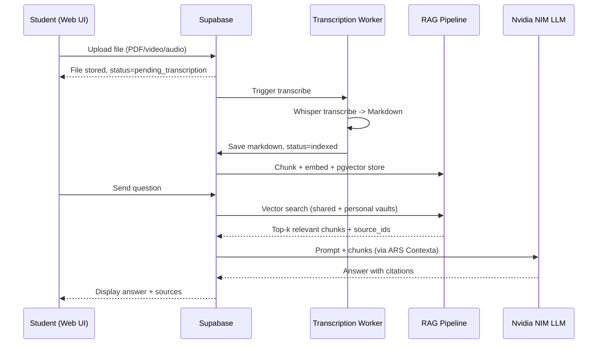

# Architecture Spine — SecondBrain

## The Problem

Studentii de Automatica anul III primesc sute de pagini de curs in PDF, inregistrari video de 2h, prezentari si notite disparate. Volumul e coplesitor: e greu de spus ce e important, limbajul academic e dens, iar cautarea pe YouTube sau ChatGPT da explicatii care nu se potrivesc cu metoda predata la curs. Nu exista un loc unic unde tot materialul sa fie indexat, sintetizat si interogabil in limbaj natural, ancorat strict in ce s-a predat.

## Pentru Cine (Stakeholders)

| Rol | Nevoi | Conturi in MVP |
|-----|-------|----------------|
| **Student** (anul III AIA) | Incarca materiale, chat-uieste cu agentul, acceseaza vault shared + personal | Da — fiecare student are cont individual |
| **Admin** (cei 3 developeri in faza MVP; ulterior studenti selectati) | Modereaza vault-ul shared (aprobare/respingere) | Da — cont cu rol admin |
| **Profesor / coordonator practica** | Poate vizualiza ce se construieste (fara acces direct in MVP) | Nu in MVP |

[ASSUMPTION: Rolul de profesor (upload de cursuri oficiale, analytics) e amanat pentru dupa MVP.]

## Data Model — Ce Date

### Vault Shared (comunitate)

| Entitate | Sursa | Format final | Stocare |
|----------|-------|-------------|---------|
| Cursuri PDF | Upload student | Markdown (dupa transcriere) | Supabase Storage -> pgvector |
| Inregistrari video | Upload student | Markdown (Whisper transcriere) | Supabase Storage -> pgvector |
| Clipuri YouTube | Link upload | Markdown (Whisper transcriere) | Supabase Storage -> pgvector |
| Prezentari (PPT, etc.) | Upload student | Markdown | Supabase Storage -> pgvector |
| Documente audio | Upload student | Markdown (Whisper transcriere) | Supabase Storage -> pgvector |
| Carti / alte docs | Upload student | Markdown | Supabase Storage -> pgvector |

### Vault Personal (per student)

Aceleasi tipuri de date ca vault shared, dar izolat per user. Documentele personale nu sunt vizibile in vault shared.

### Metadata

- `document_id` (UUID)
- `user_id` (FK -> Supabase Auth)
- `vault_type` (shared | personal)
- `source_type` (pdf | video | audio | youtube | presentation | other)
- `original_filename`
- `markdown_path` (in Supabase Storage)
- `status` (pending_transcription | transcribed | indexed | failed)
- `created_at`, `updated_at`
- `approved_by` (NULL pentru vault personal; FK user pt shared — v2)
- `embedding` (pgvector, generat din markdown chunk)

[ASSUMPTION: Structura exacta a chunk-urilor si metadatelor pentru pgvector va fi rafinata in implementare — dimensiune chunk, overlap, campuri vector vs. scalar.]

## Failure Modes

| Mod de fail | Probabilitate | Impact | Mitigare in MVP | Note |
|-------------|---------------|--------|-----------------|------|
| **Transcrierea dureaza prea mult** (video 2h pe Whisper local) | Mare | Mediu — utilizatorul nu primeste raspuns imediat | Async queue + notificare (Resend email) cand transcrierea e gata | [ASSUMPTION: Whisper local ruleaza pe ce hardware? GPU sau CPU? Asta determina timpii reali.] |
| **RAG nu gaseste chunk-ul relevant** | Mediu | Mare — raspuns incomplet | Testare cu intrebari reale; ajustare chunk size si overlap | Se imbunatateste iterativ |
| **LLM halucineaza (raspuns neancorat in surse)** | Mediu | Critic — pierdere incredere | Prompt engineering + returnarea surselor obligatorii; ARS Contexta ajuta la context | Testare riguroasa inainte de demo |
| **Vault shared contine info gresita** (fara moderare in v1) | Mare | Mediu — studenti se bazeaza pe info proasta | Adminii (3 developeri) aproba manual upload-urile in shared pana la implementarea dashboard-ului | Risc acceptat in v1 |
| **Costuri API Nvidia LLM** | Mediu | Mediu — proiect de practica fara buget | De verificat daca Nvidia NIM are tier gratuit / credits educationali | [ASSUMPTION] |
| **Performanta scade cu multi documente** | Scazut (60 useri) | Mediu | pgvector scaleaza bine pentru acest volum | Ne-ingrijorator in MVP |
| **Securitate — date personale accesibile altor useri** | Scazut | Critic — pierdere date | Row Level Security in Supabase; izolare stricta shared vs. personal | Testat obligatoriu inainte de demo |

## Design Paradigm

**RAG-pipeline + agentic-chat layered**, cu 4 straturi distincte:

```
┌──────────────────────────────────────┐
│         Presentation Layer           │
│  (Web UI — login, upload, chat)      │
├──────────────────────────────────────┤
│         Application Layer            │
│  (Auth, upload orchestration,        │
│   chat session management)           │
├──────────────────────────────────────┤
│         RAG Pipeline Layer           │
│  (Whisper -> chunk -> embed ->       │
│   pgvector index)                    │
├──────────────────────────────────────┤
│         LLM / Agent Layer            │
│  (Nvidia LLM + ARS Contexta          │
│   -> answer generation)              │
└──────────────────────────────────────┘
```

[ASSUMPTION: Paradigma exacta (monolit Next.js vs backend separat) depinde de cum impartiti munca 3 persoane — Next.js App Router poate tine si backend-ul, sau puteti separa un backend API.]

## Invariants & Rules

### AD-1 — Doua vaulturi cu izolare stricta

- **Binds:** intreaga aplicatie — storage, RAG, query
- **Prevents:** un student sa acceseze documente personale ale altui student, sau ca documentele personale sa polueze vault-ul shared
- **Rule:** Fiecare document apartine exact unui vault (shared | personal). Query-urile RAG se fac pe vaultul selectat de utilizator. Supabase RLS aplica `user_id = auth.uid()` pentru vault personal. Pentru shared, `vault_type = 'shared'` si `status = 'approved'` (v2) — in v1, shared e accesibil oricarui user autentificat.

### AD-2 — Markdown ca format canonic

- **Binds:** pipeline-ul de ingestie
- **Prevents:** formate divergente de chunking si embeddding pentru fiecare tip de document
- **Rule:** Orice document intrare (PDF, video, audio, PPT) trece prin transcriere/transformare in Markdown inainte de chunking si indexare. Markdown-ul transcris se pastreaza in Supabase Storage ca sursa de adevar.

### AD-3 — Pipeline de transcriere asincron

- **Binds:** upload flow
- **Prevents:** blocarea UI in timp ce Whisper proceseaza un video de 2h
- **Rule:** Upload-ul e sincron (fisierul ajunge in Storage imediat). Transcrierea e asincrona: documentul primeste status `pending_transcription`, un worker proceseaza cu Whisper, iar userul e notificat (in-app sau email via Resend) cand e gata.

### AD-4 — RAG pgvector cu surse obligatorii

- **Binds:** LLM / Agent Layer
- **Prevents:** LLM sa raspunda pe baza cunostintelor proprii (hallucinatie) in loc de documentele incarcate
- **Rule:** Orice raspuns al LLM-ului include cel putin un `source_id` (document + chunk). Daca RAG nu returneaza niciun chunk relevant, LLM-ul raspunde cu "Nu am gasit aceasta informatie in materialele incarcate" — nu inventeaza.

## Consistency Conventions

| Concern | Convention |
|---------|-----------|
| IDs | UUID v4 pentru toate entitatile |
| Dates | ISO 8601 UTC (2026-06-29T12:00:00Z) |
| Document status | pending_transcription -> transcribing -> indexed / failed |
| Embedding vector | 1536-dimensional (pgvector) — [ASSUMPTION: dimensiunea depinde de modelul de embedding ales] |
| Auth | Supabase Auth (email/password + magic link) |
| RLS | Fiecare tabel cu `user_id` are politici RLS care izoleaza datele personale |
| Error format | `{ error: string, code: string, detail?: string }` |

## Stack

| Name | Version / Detalii |
|------|-------------------|
| Supabase (Auth, DB, Storage, pgvector) | latest |
| Nvidia NIM LLM API | TBD (llama-3.3-nemotron-super-49b sau alt model) [ASSUMPTION] |
| Whisper (local) | TBD |
| ARS Contexta | v0.8.0 |
| Resend (email notifications) | latest |
| Vercel (frontend deploy) | latest |
| Render (backend/worker deploy) | latest |

[ASSUMPTION: Frontend frameworkul (Next.js, React, etc.) si back-end-ul (Next.js API routes vs. server separat) nu au fost decise — depinde de impartirea muncii intre 3 persoane.]

## Structural Seed

```text
secondbrain/
  web/                    # Frontend (Next.js / React)
    app/
      login/
      dashboard/
      chat/
      upload/
  api/                    # Backend (API routes sau server separat)
    auth/                 # Supabase Auth integration
    upload/               # Upload orchestration
    transcription/        # Whisper worker
    rag/                  # pgvector query + RAG pipeline
    agent/                # Nvidia LLM + ARS Contexta integration
  shared/                 # Tipuri, utilitare, config
    types/
    constants/
  supabase/               # Migrations, RLS policies, seed
    migrations/
    seed.sql
```

[ASSUMPTION: Structura exacta va fi determinata de frameworkul ales si de cum impartiti munca. Alternativa: totul intr-un monolit Next.js App Router.]

## Data Flow



## Capability → Architecture Map

| Capability | Lives in | Governed by |
|------------|----------|-------------|
| Autentificare | Supabase Auth + web/login | AD-1 (RLS) |
| Upload documente | web/upload -> api/upload -> Supabase Storage | AD-3 (async pipeline) |
| Transcriere | api/transcription (Whisper worker) | AD-2 (markdown), AD-3 (async) |
| Indexare RAG | api/rag (chunk -> embed -> pgvector) | AD-2 (markdown input) |
| Chat agentic | api/agent -> Nvidia NIM | AD-4 (sources required) |
| Vault shared + personal | Toti componentii cu `vault_type` | AD-1 (izolare) |

## Deferred

| Decizie | De ce se amana | Cand se reia |
|---------|----------------|--------------|
| Admin dashboard (approve/reject) | Nu e critic pentru MVP — adminii (3 devs) aproba manual | Dupa MVP, cand vault-ul shared creste |
| Model Nvidia exact | Mai multe optiuni disponibile; ales in functie de cost/tier gratuit | In prima saptamana de implementare |
| Framework frontend exact | Depinde de skill-urile echipei si impartirea muncii | In prima zi de implementare |
| Embedding model | Ales in functie de modelul Nvidia sau altul gratuit | In prima saptamana |
| Whisper hardware (CPU vs GPU) | Impacteaza timpii de procesare | In implementare — de testat local |
| Mobile app | Inutil in MVP — focus pe web | Post-practica |
| Plati / monetizare | Proiect de practica — fara business model inca | Post-practica |
